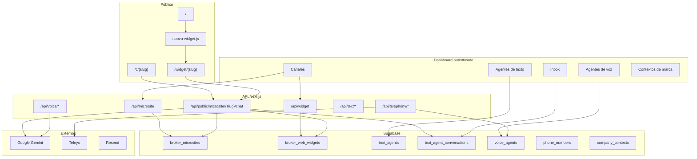

# Arquitectura — Noova 360

Visión técnica para entender, extender o replicar la aplicación.

## Diagrama general



## Principios de diseño

1. **Canales independientes** — Mi Link, widget web, teléfono y WhatsApp son productos paralelos. No comparten fila de configuración ni dependen uno del otro para existir.
2. **Un agente por canal** — Cada canal apunta a un `text_agent_id` o `voice_agent_id` del mismo `user_id` (corredor).
3. **Conversaciones por canal** — La columna `channel` en `text_agent_conversations` separa tráfico (`web_widget`, `web_embed`, etc.).
4. **Service role en servidor** — Las API routes usan `SUPABASE_SERVICE_ROLE_KEY` para operaciones que RLS no cubre en contexto anónimo (chat público, admin).
5. **Servidor custom** — `server.ts` arranca Next y expone WebSocket para media de Telnyx (`/telephony/ws/telnyx-media`).

## Canales de atención

| Canal | Tabla config | URL pública | `channel` en inbox | API dashboard |
|-------|--------------|-------------|-------------------|---------------|
| **Mi Link** | `broker_microsites` | `/c/{slug}` | `web_widget` | `GET/POST /api/microsite` |
| **Widget web** | `broker_web_widgets` | `/widget/{slug}` | `web_embed` | `GET/POST /api/widget` |
| **Teléfono** | `phone_numbers` | — (entrante PSTN) | voz / llamadas | `/api/telephony/*` |
| **WhatsApp** | (en desarrollo) | — | — | `/dashboard/canales/whatsapp` |

Los slugs de Mi Link y widget **pueden coincidir o no**; viven en tablas distintas con namespaces de URL distintos.

### Mi Link (`broker_microsites`)

- Una fila por usuario (`user_id` unique).
- Página de chat completa en `/c/{slug}` (plantilla `agenteclientes`).
- Subdominio opcional `link.noova360.com/{slug}` → rewrite a `/c/{slug}` vía `middleware.ts`.

### Widget web (`broker_web_widgets`)

- Una fila por usuario (`user_id` unique), **sin FK a micrositio**.
- Página iframe en `/widget/{slug}`.
- Script embebible: `public/noova-widget.js` con `data-slug`, `data-base`, `data-color`.
- Preview en borrador: `?preview=1` (solo landing con `NEXT_PUBLIC_LANDING_WIDGET_SLUG`).

### Chat público unificado

Endpoint: `POST /api/public/microsite/[slug]/chat`

El parámetro `channel` decide de qué tabla resolver el slug:

- `web_embed` → `resolveWidgetAgentForChat` (`broker_web_widgets`)
- default / `web_widget` → `resolveMicrositeAgentForChat` (`broker_microsites`)

Mismo endpoint, fuentes de config distintas.

## Módulos del dashboard

```
/dashboard
├── canales/
│   ├── mi-link/      → MicrositeConfigPanel
│   ├── widget/       → WidgetChannelPanel
│   ├── telefono/     → líneas y agente asignado
│   └── whatsapp/     → placeholder
├── agentes-texto/    → CRUD agentes Gemini texto
├── agentes-voz/      → CRUD agentes Gemini Live
├── inbox/            → conversaciones texto + handoff humano
├── micrositio/       → redirects legacy → canales
└── admin/            → telefonía admin, usuarios
```

Navegación lateral: `src/lib/canales-nav.ts`, `agentes-texto-nav.ts`, `agentes-voz-nav.ts`.

## Agentes de IA

### Texto (`text_agents`)

- Prompt, temperatura, modelo Gemini.
- Vinculado a `company_contexts` (conocimiento de marca).
- Chat en dashboard: `/api/text/agents/chat`.
- Chat público: `/api/public/microsite/[slug]/chat` con persistencia en `text_agent_conversations`.

### Voz (`voice_agents`)

- Config para Gemini Live en navegador (`VoiceSessionPanel`) y llamadas Telnyx.
- Registro de llamadas: `voice_agent_calls`, grabaciones en Storage.

### Ori (copiloto interno)

- API key separada: `ORI_GOOGLE_AI_KEY` (facturación propia).
- Modelo: `ORI_GEMINI_MODEL` (default `gemini-2.5-flash`).

## Telefonía

- Proveedor activo: `TELEPHONY_PROVIDER` (`telnyx` por defecto).
- Webhooks HTTP: `/api/telephony/webhooks/telnyx/voice`, Twilio legacy.
- WebSocket media: `server.ts` → `handleTelnyxMediaSocket` → bridge Gemini Live.
- Opcional Pipecat self-hosted: `PIPECAT_WS_URL` + `PIPECAT_INTERNAL_SECRET`.

Tablas: `phone_numbers`, `phone_line_requests`, `test_phone_numbers`.

## Inbox y handoff

Tabla `text_agent_conversations`:

| Campo | Uso |
|-------|-----|
| `channel` | Origen (`web_widget`, `web_embed`, `web_test`, …) |
| `handoff_mode` | `ai` \| `human` |
| `assigned_to` | Usuario humano asignado |
| `messages` | JSON array de turnos |
| `unread_count` | Badge en inbox |

Cuando `handoff_mode === "human"`, el chat público deja de invocar Gemini y solo persiste mensajes del visitante hasta respuesta del asesor.

## Autenticación

- Supabase Auth (email/password).
- Cliente browser: `src/lib/supabase.ts` (anon key).
- Server admin: `textAgentsAdminClient()` / `voiceAgentsAdminClient()` con service role.
- Middleware: rewrite de subdominio link; no protege rutas (auth en layout/páginas).

## Almacenamiento

- Assets de micrositio/widget: bucket Supabase Storage (`microsite-storage.ts`, `widget-storage.ts`).
- Grabaciones de voz: bucket dedicado (`voice-call-storage.ts`).

## Base de datos

Migraciones incrementales en `supabase/migrations/`:

| # | Tema |
|---|------|
| 001–003 | Agentes de voz |
| 004–005 | Contextos de marca |
| 006–007 | Llamadas y grabaciones |
| 008–011 | Teléfono y líneas de prueba |
| 012–013 | Agentes de texto y conversaciones |
| 014–015 | Micrositios (Mi Link) |
| 016 | Inbox handoff |
| 017 | Landing leads |
| 018–020 | Widget web standalone |

Instalación nueva: aplicar migraciones en orden o ejecutar `supabase/APPLY_IN_SUPABASE.sql` (esquema consolidado).

RLS: cada tabla de tenant filtra por `user_id = auth.uid()` (widgets y micrositios directo; conversaciones vía dueño del agente).

## Despliegue

- Producción referenciada: **Coolify** en `https://app.noova360.com`.
- `NOOVA_APP_URL` debe ser HTTPS público para webhooks Telnyx.
- Build: `npm run build` → `npm run start`.
- Variables de entorno en el host (equivalente a `.env.local`).

Ver [ROLLBACK-Y-BACKUPS.md](ROLLBACK-Y-BACKUPS.md) para rollback y backups.

## Extender la app

| Quiero… | Dónde mirar |
|---------|-------------|
| Ficha de contacto (producto) | [specs/NOOVA360_Spec_Ficha_Contacto.md](specs/NOOVA360_Spec_Ficha_Contacto.md) |
| Nuevo canal de texto | Nueva tabla + API + panel en `dashboard/canales/` + `channel` en conversaciones |
| Cambiar UI chat público | `src/app/agenteclientes/`, `src/components/widget/WebChatWidget.tsx` |
| Nuevo webhook telefonía | `src/app/api/telephony/webhooks/` |
| Plantilla de agente | `src/lib/text-agent-templates.ts`, `voice-agent-templates.ts` |

## Decisiones registradas (ADR)

- [001 — Widget independiente de Mi Link](adr/001-widget-standalone.md)
