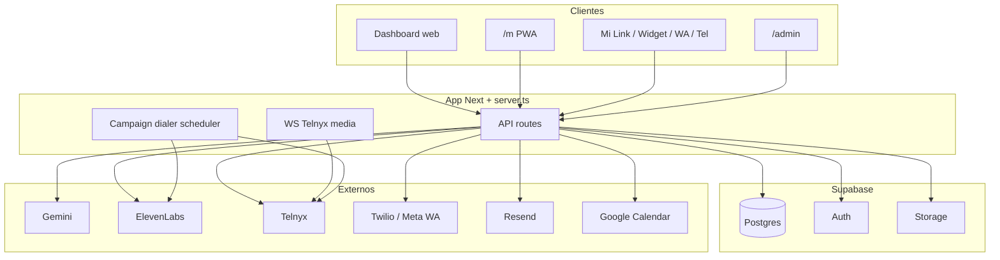

# Informe técnico de producto — Noova 360

**Fecha:** 26 julio 2026  
**Repositorio:** `brightgroup/appnoova`  
**Producción:** `https://app.noova360.com`  
**Alcance:** inventario técnico del código + madurez funcional observada

> **Nota sobre documentación previa**  
> En este repo **no existía** un informe único, actualizado y exhaustivo de “todo lo que tiene la app + funcionalidades validadas”. Lo más cercano era:
>
> | Documento | Qué cubre | Limitación |
> |-----------|-----------|------------|
> | [`docs/ARCHITECTURE.md`](./ARCHITECTURE.md) | Arquitectura y canales | Parcialmente desfasado (p. ej. WhatsApp como “en desarrollo”) |
> | [`docs/DEVELOPMENT.md`](./DEVELOPMENT.md) | Setup local y migraciones | No es inventario de producto |
> | [`docs/specs/*`](./specs/README.md) | Specs Contacto / Lead / Multitenant | Diseño, no estado QA |
> | [`README.md`](../README.md) | Quick start | Superficial |
>
> Este documento es el **informe consolidado** al estado del código en esta fecha.

---

## 1. Resumen ejecutivo

Noova 360 es una plataforma **multitenant** (organizaciones + RBAC) para operar:

- Agentes de **texto** (Gemini) y **voz** (Gemini Live + ElevenLabs premium)
- Canales: **Mi Link**, **widget web**, **WhatsApp** (Twilio/Meta), **teléfono** (Telnyx)
- **Inbox** unificado con handoff a humano
- **CRM** (contactos + leads/pipeline)
- **Campañas** de voz salientes (dialer)
- **Facturación** por créditos/consumo
- **Conectores** (Google Calendar + agendamiento)
- App **móvil PWA** (`/m`) con Web Push
- Panel **superadmin** (`/admin`)

**Stack:** Next.js 15 (App Router) + React 19 + servidor custom (`server.ts`) + Supabase (Postgres/Auth/Storage) + Coolify/Docker.

**Escala aproximada del código (inventario):**

| Métrica | Valor |
|---------|-------|
| Migraciones SQL | 83 (`001` … `083`) |
| Rutas API (`route.ts`) | ~137 |
| Páginas dashboard | ~47 `page.tsx` |
| Suite de tests automatizados | **No hay** (Jest/Vitest/Playwright de producto) |

---

## 2. Stack e infraestructura

### 2.1 Capas

| Capa | Tecnología |
|------|------------|
| Frontend / API | Next.js 15.2 + React 19 (App Router) |
| Servidor | `server.ts` (tsx): HTTP Next + WebSocket Telnyx + scheduler de dialer |
| Puerto | `8000` (`http://127.0.0.1:8000` local) |
| BD / Auth / Storage | Supabase (Postgres + Auth + Storage) |
| IA texto | Google Gemini (`@google/genai`) |
| IA voz | Gemini Live + ElevenLabs (`@elevenlabs/client`) |
| Telefonía | Telnyx (principal), Twilio (WhatsApp + voz legacy) |
| Email | Resend |
| Push | `web-push` (VAPID) |
| Deploy | Coolify + Docker (`Dockerfile`, workflows Coolify) |
| Marketing | Paquete separado `export/marketing-site/` → `noova360.com` |

### 2.2 Rol de `server.ts`

No es solo `next start`. El proceso custom:

1. Arranca Next en `0.0.0.0:8000`
2. Expone WebSocket de media Telnyx (`/api/telephony/ws/telnyx-media`)
3. Arranca el **scheduler del dialer de campañas** en proceso

### 2.3 Variables de entorno (categorías)

Definidas en `.env.example` (sin secretos aquí):

1. Supabase  
2. URLs de la app / marketing / Mi Link  
3. Google AI (+ ORI)  
4. Widget embebible  
5. Telefonía (Telnyx, Twilio, Meta, Pipecat, ElevenLabs)  
6. Conectores Google Calendar  
7. Email (Resend)  
8. Web Push (VAPID)  
9. Cron / jobs internos  
10. Servidor opcional  

### 2.4 Deploy

- App principal: Coolify → `app.noova360.com`
- Servicio opcional Pipecat: `services/pipecat-voice/`
- Marketing: deploy independiente desde `export/marketing-site/`

---

## 3. Arquitectura funcional

### Principios observados en código

1. **Multitenant por organización** + roles (`owner`, `org_admin`, `manager`, `advisor`, `viewer`)
2. **Canales independientes** con config propia (Mi Link, widget, WhatsApp, teléfono)
3. **Service role en servidor** para chat público, webhooks y admin
4. **Billing por consumo** (créditos / minutos / eventos)
5. **Agentes con tools** (notificar equipo, agendar, CRM, tablas de datos)

---

## 4. Módulos del producto (dashboard org)

Guard: `DesktopOnlyGate` + RBAC (`OrgPermissionsProvider` / `DashboardRouteGuard`).

| Módulo | Ruta | Permiso | Función |
|--------|------|---------|---------|
| Home | `/dashboard` | — | Stats, actividad, leads recientes |
| Agentes de voz | `/dashboard/agentes-voz` | `voice_agents` | CRUD + prueba + historial + premium |
| Agentes de texto | `/dashboard/agentes-texto` | `text_agents` | CRUD + chat prueba + reglas notify/schedule |
| Inbox | `/dashboard/inbox` | `inbox` | Conversaciones omnicanal + handoff |
| Canales | `/dashboard/canales/*` | `channels` | Mi Link, widget, teléfono, WhatsApp |
| Conectores | `/dashboard/conectores/google-calendar` | `conectores` | OAuth / hosted Calendar |
| CRM Contactos | `/dashboard/crm/contactos` | `crm` | Ficha, docs, IA, timeline |
| CRM Leads | `/dashboard/crm/leads` | `crm` | Pipeline / oportunidades |
| Campañas | `/dashboard/campaigns` | `campaigns` | Outbound voz + audiencias |
| Tablas | `/dashboard/tablas` | `campaigns` | Excel → audiencias / catálogos |
| ORI | `/dashboard/ori` | — | Copiloto interno (Gemini) |
| Contextos | `/dashboard/contextos` | `company_context` | Marca / conocimiento |
| Equipo | `/dashboard/equipo` | `org_users` | Miembros e invitaciones |
| Facturación | `/dashboard/facturacion` | `billing` | Plan, créditos, uso |
| Configuración | `/dashboard/configuracion` | — | Tema + horario de atención |
| Perfil | `/dashboard/perfil` | — | Datos del usuario |

**RBAC — módulos org:**  
`voice_agents`, `text_agents`, `inbox`, `crm`, `campaigns`, `flow_studio` *(no implementado)*, `channels`, `conectores`, `whatsapp` *(oculto, cubierto por channels)*, `telephony` *(oculto)*, `billing`, `company_context`, `org_users`.

**Niveles:** `none` → `view` → `edit` → `manage`.

---

## 5. Superficies públicas y móvil

| Superficie | URL / asset | Descripción |
|------------|-------------|-------------|
| Mi Link | `/c/{slug}` | Chat público de marca |
| Widget iframe | `/widget/{slug}` | Chat embebible |
| Script | `public/noova-widget.js` | Launcher flotante → iframe |
| Mobile PWA | `/m/*` | Chats, cuenta, facturación, install, push |
| Login | `/login` | Auth Supabase (desktop) |
| Signup | `/signup` | Redirige a marketing (no self-serve completo) |
| Admin | `/admin/*` | Superadmin plataforma |
| Privacy | `/privacy` | Privacidad |
| Marketing | `export/marketing-site` | Sitio `noova360.com` |

---

## 6. Dominios técnicos detallados

### 6.1 Agentes de texto

- Persistencia: `text_agents`, `text_agent_conversations`
- Generación: `src/lib/text-agent-generate.ts` + Gemini
- Tools: notify_team, scheduling, tablas de datos, handoff
- Canales de entrada: Mi Link, widget, WhatsApp inbound, chat de prueba
- Reglas: `notify_rules`, `scheduling_rules`, `thinking_enabled`, límites de tokens

### 6.2 Agentes de voz

- **Estándar:** Gemini Live (navegador + bridge Telnyx)
- **Premium:** ElevenLabs (sesión web, SIP, outbound)
- Historial: `voice_agent_calls` + grabaciones en Storage
- UI mockups (no productizadas): `design-proposals/voice-agent-ui/`

### 6.3 WhatsApp

- Proveedor default: **Twilio** (`WHATSAPP_DEFAULT_PROVIDER`)
- Embedded Signup Meta → provisión Twilio
- Plantillas, media, webhooks Twilio/Meta
- Opción Meta directo: parcialmente pendiente en envío
- Coexistencia con WA Business App: documentada, **no implementada** (`docs/whatsapp-coexistence-context.md`)

### 6.4 Telefonía

- Telnyx call control + media WS
- Líneas, requests, test numbers
- Bridge Gemini / Pipecat
- Twilio voice legacy opcional
- Vapi: stub “próximamente”

### 6.5 Inbox

- Lista unificada, reply, templates WA, assignees
- Handoff humano + auto-asignación
- Notificaciones email / push al equipo

### 6.6 CRM

- Contactos (ficha, properties, merge, duplicates, timeline)
- Leads / stages / labels / quote
- Criterios IA de etapa (`stage_ai_criteria`)
- Specs: `docs/specs/NOOVA360_Spec_*.md`

### 6.7 Campañas de voz

- Audiencias desde tablas / CRM
- Dialer concurrente + reglas admin (`/admin/motor-llamadas`)
- Disposiciones, finalize, AMD → ElevenLabs outbound
- Guía: `docs/guia-administrador-campanas-llamadas.md`

### 6.8 Billing

- Planes, wallet, créditos USD, consumo por evento
- Admin pricing / topup / invoices
- Auto-recarga / pasarela de pago: **aún no**

### 6.9 Conectores y agendamiento

- Google Calendar OAuth + modo hosted
- `appointments`, `scheduling_rules`, `organizations.business_hours`
- Tools de agente: buscar horarios / crear cita
- Notificación de cita al equipo

### 6.10 Mobile (`/m`)

- Splash, login, install PWA, chats, detalle, cuenta, facturación
- Web Push (VAPID)
- Branding: logo Noova 360 + icono app fondo oscuro
- Tipografía listado chats + avatares blancos/negros (julio 2026)

---

## 7. Modelo de datos (migraciones)

**Última migración inventariada:** `083_text_agent_thinking_enabled.sql`  
**Total:** 83 archivos en `supabase/migrations/`.

Temas principales:

| Tema | Ejemplos |
|------|----------|
| Voice / calls / ElevenLabs | 001–007, 047–048, 064 |
| Text agents / notify / thinking | 012–013, 074, 081–083 |
| Microsite / widget | 014–020 |
| WhatsApp | 021–025, 037–039, 049–050 |
| CRM | 026–032 |
| Multitenant RBAC | 033–036, 040, 058, 062–063 |
| Billing / plans | 041–046, 051–057, 061, 071 |
| Campaigns / dialer | 060, 065–070, 072 |
| Web push | 073 |
| Calendar / scheduling / conectores | 075–080 |
| Business hours | 079 |

Aplicación: `npm run db:migrate` (`scripts/apply-all-migrations.mjs` + `schema_migrations`).

---

## 8. Integraciones externas

| Integración | Uso principal | Madurez en código |
|-------------|---------------|-------------------|
| **Gemini** | Texto, voz Live, ORI, CRM AI, análisis | Alta |
| **ElevenLabs** | Voz premium, SIP, outbound campañas | Alta |
| **Telnyx** | PSTN, media WS, dialer, SIP EL | Alta |
| **Twilio** | WhatsApp + voz legacy | Alta (WA) |
| **Meta Graph** | Embedded Signup, webhook Cloud API | Media–alta |
| **Resend** | Emails transaccionales / notify | Alta |
| **Google Calendar** | Conector + citas | Media–alta (módulo reciente) |
| **Web Push** | PWA `/m` | Alta |
| **Pipecat** | Bot voz alternativo (servicio aparte) | Opcional |
| **Vapi** | Stub | No |

---

## 9. Superficie API (agrupada)

~137 `route.ts`. Dominios:

- **Org / RBAC / business-hours**
- **Text agents** (CRUD, chat, conversations, analyze)
- **Voice** (agents, calls, elevenlabs/*, gemini-config)
- **Telephony** (numbers, webhooks Telnyx/Twilio/EL, pipecat, diagnostics)
- **WhatsApp** (channels, templates, embedded-signup, sync)
- **Inbox** (list, reply, template, assignees)
- **CRM** (contacts, leads, properties, stages, labels)
- **Campaigns + data-tables + cron dialer**
- **Billing / pricing / cron billing**
- **Conectores Google Calendar**
- **Public** (microsite chat, widget)
- **Push** subscribe/unsubscribe
- **Admin** (orgs, users, roles, telephony, WA, pricing, motor-llamadas)
- **ORI / company-contexts / dashboard stats**

---

## 10. Panel superadmin (`/admin`)

| Área | Función |
|------|---------|
| Overview | Colas / pendientes |
| Organizations | Gestión de orgs |
| Users / Roles | Usuarios y plantillas RBAC |
| Billing / Consumption / Pricing | Planes, topups, tarifas |
| Telephony | Provisión y líneas |
| WhatsApp | Operación WA |
| Motor de llamadas | Reglas globales del dialer |

---

## 11. Madurez: qué está cableado vs incompleto

### 11.1 Cableado de extremo a extremo (código + migraciones + UI)

- Multitenant + RBAC org  
- Agentes texto + inbox + handoff  
- WhatsApp vía Twilio + plantillas + Embedded Signup  
- Voz Gemini Live + ElevenLabs premium + Telnyx  
- Campañas outbound + dialer  
- CRM contactos/leads  
- Billing créditos/consumo (admin)  
- Mi Link + widget standalone  
- Google Calendar + scheduling tools  
- PWA móvil + push  
- ORI fase 1 (chat)  
- Branding Noova 360 (logo/favicon/app icon)

### 11.2 Incompleto / diferido (señales en código o docs)

| Ítem | Señal |
|------|-------|
| Flow Studio | Módulo RBAC oculto: “aún no implementados” |
| Vapi | Stub “próximamente” |
| Envío Meta directo WA | Pendiente en transport |
| Coexistencia WA Business | Doc pendiente de implementar |
| ORI adjuntos / voz | UI “próximamente” |
| Auto-recarga / pasarela pago | Facturación incompleta |
| Export Google Sheets campañas | “Próximamente” |
| Comentarios en registros chat/llamada | “Próximamente” |
| Rediseño UI agentes de voz | Solo `design-proposals/` |
| Signup self-serve completo | Redirige a marketing |
| Tests automatizados | Ausentes en producto |

---

## 12. Sobre “funcionalidades probadas y validadas”

### 12.1 Hecho objetivo

**No existe en el repositorio** una matriz QA formal ni suite CI de tests E2E/unitarios del producto.  
Por tanto, **este informe no puede certificar cobertura de pruebas automatizadas**.

### 12.2 Validación práctica observada (manual / producción)

Con base en el historial de trabajo del producto (fixes en prod, migraciones aplicadas, uso real de canales), estas áreas han sido **ejercitadas manualmente en entornos reales** (no equivalen a un plan de pruebas firmado):

| Área | Evidencia de uso real |
|------|------------------------|
| WhatsApp Embedded Signup / Twilio senders | Fixes 63100/20409, adopción de sender, canales ONLINE |
| Widget móvil fullscreen | Fix CSS/JS publicado |
| Notify team (`notify_team` + reglas) | Migración 074 + wiring inbound/chat |
| Inbox handoff / asignación | Fixes de etiquetas y auto-asignación |
| Campañas / dialer | Código + admin motor + guía operativa |
| Billing credits / planes | Módulo admin + migraciones de pricing |
| Google Calendar / citas | Migraciones 075–080 + UI conectores |
| Mobile branding + listado chats | Commits brand + tipografía avatares |
| Superadmin cambio de password | Feature publicada |

### 12.3 Cómo interpretar “validado”

| Etiqueta | Significado en este informe |
|----------|-----------------------------|
| **Implementado** | Hay UI + API + persistencia coherentes |
| **Ejercitado en prod/manual** | Se usó o se corrigió con evidencia en commits |
| **No validado formalmente** | Sin matriz QA ni tests automatizados |
| **Pendiente** | Stub, placeholder o doc sin código |

---

## 13. Seguridad y operación (alto nivel)

- Auth Supabase; RLS en tablas sensibles; service role solo en servidor  
- Tokens Calendar cifrados en app (`CALENDAR_TOKEN_ENC_KEY`)  
- Webhooks con validación de firma (Twilio/Meta según ruta)  
- Backups: `npm run backup:db` + guía `docs/ROLLBACK-Y-BACKUPS.md`  
- Deploy Coolify con watchpaths; Pipecat como servicio aparte  

---

## 14. Documentación existente (índice)

| Doc | Contenido |
|-----|-----------|
| [`ARCHITECTURE.md`](./ARCHITECTURE.md) | Arquitectura (parcialmente desfasada) |
| [`DEVELOPMENT.md`](./DEVELOPMENT.md) | Desarrollo local |
| [`ROLLBACK-Y-BACKUPS.md`](./ROLLBACK-Y-BACKUPS.md) | Rollback y backups |
| [`PRICING.md`](./PRICING.md) | Costos/márgenes internos |
| [`ORI-AND-VOICE-ROADMAP.md`](./ORI-AND-VOICE-ROADMAP.md) | Roadmap ORI/voz |
| [`GEMINI-LIVE-VOICE.md`](./GEMINI-LIVE-VOICE.md) | Tuning Gemini Live |
| [`guia-administrador-campanas-llamadas.md`](./guia-administrador-campanas-llamadas.md) | Ops campañas |
| [`whatsapp-coexistence-context.md`](./whatsapp-coexistence-context.md) | Decisión WA coexistencia |
| [`adr/001-widget-standalone.md`](./adr/001-widget-standalone.md) | ADR widget |
| [`specs/`](./specs/README.md) | Specs Contacto / Lead / Multitenant |
| **Este archivo** | Informe técnico consolidado |

---

## 15. Conclusión

Noova 360 es una plataforma **amplia y operativa** en producción: omnicanalidad (web/WA/voz), CRM, campañas, billing, RBAC y PWA móvil están **implementados y en uso**.  

Lo que **no** hay hoy:

1. Un informe QA formal previo (este documento lo inaugura como inventario técnico)  
2. Suite de tests automatizados de producto  
3. Algunos módulos anunciados (Flow Studio, pasarela de pago, Meta directo completo, coexistencia WA)

**Recomendación:** tratar este MD como fuente de verdad de inventario; complementar con una matriz QA viva (casos por módulo × org × canal) si se necesita certificación formal de “validado”.

---

*Generado a partir del estado del repositorio el 26 jul 2026. Actualizar este archivo cuando cambien módulos mayores o la última migración.*
