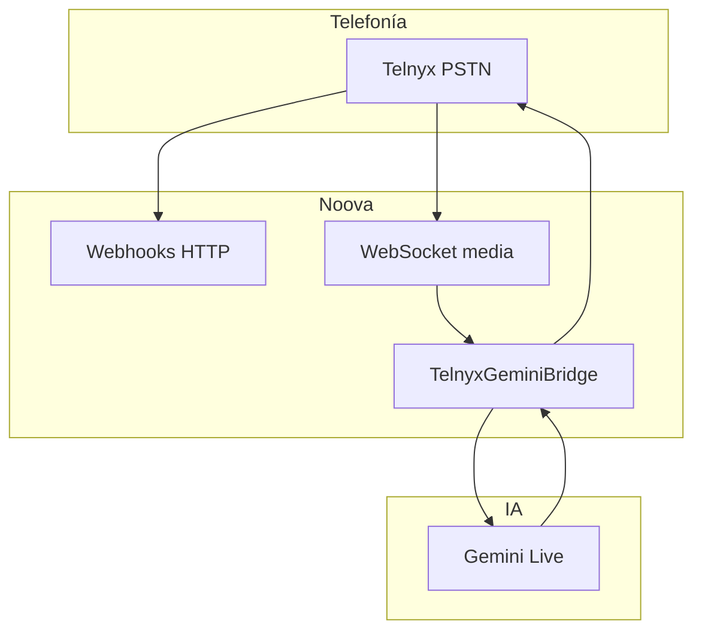

# Roadmap ORI y voz en producción — Noova 360

Documento maestro para implementar por fases. Cuando digas *"vamos a hacerlo"*, seguir el orden de cada sección.

---

## Parte A — ORI (copiloto)

### Estado actual

| Componente | Ubicación | Qué hace |
|------------|-----------|----------|
| Chat UI | `src/app/dashboard/ori/page.tsx` | Conversación + selector de contexto de empresa |
| API | `src/app/api/ori/chat/route.ts` | Gemini + contexto de marca |
| Persona | `src/lib/ori-prompt.ts` | Rol comercial genérico |
| Contexto empresa | `company_contexts` + selector ORI | Productos, tono, servicios del cliente |

### Alcance acordado (Fase 1 — implementada)

ORI responde **solo**:

1. **Uso básico de Noova 360** — crear agentes, ver llamadas, inbox, facturación, contextos (con guías recuperadas por keyword).
2. **Tareas comerciales de la empresa del usuario** — redactar prompts, cotizaciones, correos, mensajes WhatsApp usando el contexto de marca seleccionado.

ORI **no** responde temas ajenos (política, medicina, chistes, tareas personales, etc.) y redirige con cortesía.

### Fases siguientes

| Fase | Entregable | Esfuerzo |
|------|------------|----------|
| **1** ✅ | Guías estáticas + retrieval + prompt acotado | 1–2 días |
| **2** | Historial ORI en BD, links profundos, scoping por `organization_id` | 1–2 días |
| **3** | Tools ORI (consultar agentes, créditos, llamadas recientes) | 2–3 días |
| **4** | Editor de ayuda en superadmin | ~1 semana |

### Archivos clave (Fase 1)

- `src/lib/platform-help/articles.ts` — artículos de ayuda
- `src/lib/platform-help/retrieve.ts` — selección por keywords
- `src/lib/ori-prompt.ts` — persona + límites
- `src/lib/merge-ori-context.ts` — capas: plataforma → empresa → persona
- `src/app/api/ori/chat/route.ts` — inyección en runtime

---

## Parte B — Voz colombiana / paisa

### Stack actual

```
Cliente ↔ Telnyx (PSTN) ↔ WebSocket (server.ts) ↔ TelnyxGeminiBridge ↔ Gemini Live
```

| Capa | Proveedor | Equivalente “Twilio” |
|------|-----------|----------------------|
| Línea telefónica | **Telnyx** | Sí — carrier de voz |
| WhatsApp | **Twilio** | Canal aparte |
| Cerebro + voz | **Gemini Live** | No hay SaaS intermedio (Vapi/Retell); es custom |

### Mejoras implementadas (prompt + plantillas)

- Perfiles de acento por plantilla: `src/lib/voice-accent-profile.ts`
- Reglas de voz en cada prompt generado (`agent-prompt-generator.ts`)
- Instrucción telefónica unificada (`phone-agent-instruction.ts`)
- Fallback Telnyx TTS: **es-CO** (Polly Lupe)
- Wizard voz: idioma default **es**, voz sugerida por plantilla
- Kickoff de llamada adaptado al tono de cada plantilla

### Perfiles por plantilla (voz)

| Plantilla | Tono | Voz sugerida |
|-----------|------|--------------|
| Calificación de leads | Paisa alegre, cercana | Kore / Aoede |
| Recordatorios | Serio, formal, claro | Charon |
| Seguimiento comercial | Paisa cálida, profesional | Aoede |
| Atención al cliente | Paisa empática, tranquila | Kore |
| Agendar reuniones | Paisa eficiente, amable | Aoede |

### Fases siguientes (voz hiperrealista / producción)

| Fase | Entregable | Prioridad |
|------|------------|-----------|
| **V1** ✅ | Prompt experto paisa + `gemini-live-config` + doc AI Studio | Alta |
| **V2** | Inbound producción con Gemini Live (hoy solo saludo Polly) | **Crítica** |
| **V3** | Load test 50–100 concurrentes, cuotas Telnyx/Gemini | Alta |
| **V4** | Redis para sesiones bridge + worker de voz separado | Media |
| **V5** | POC ElevenLabs / Azure es-CO en Pipecat | Opcional |
| **V6** | Monitoreo + alertas (`/api/telephony/diagnostics` extendido) | Alta |

---

## Parte C — Estabilidad en producción (5.000+ llamadas)

### Aclarar volumen

| Escenario | ¿Aguanta arquitectura actual? |
|-----------|-------------------------------|
| 5.000 / mes (~7/h promedio) | Sí, con config correcta |
| 5.000 / día (~200/h pico) | Requiere Fase V3–V4 |
| 5.000 simultáneas | Arquitectura distinta (colas, sharding) |

### Checklist pre-go-live (cliente grande)

- [ ] `GET /api/telephony/diagnostics` → `gemini_live_ok: true`
- [ ] `NOOVA_APP_URL` HTTPS + WebSocket `wss://…/api/telephony/ws/telnyx-media` accesible
- [ ] Número Telnyx activo + agente asignado
- [ ] Prueba outbound **y** inbound con IA completa (V2)
- [ ] Créditos suficientes en facturación
- [ ] CPS / concurrentes negociados con Telnyx
- [ ] Cuota Gemini Live ampliada en Google AI Studio

### Limitaciones actuales del código

1. **Sesiones bridge en memoria** (`bridge-session-store.ts`) — no sobrevive reinicios ni multi-instancia.
2. **Un proceso Node** — Next + WebSocket comparten CPU.
3. **Sin cola** para picos de llamadas salientes.
4. **Inbound producción** — ver Fase V2 (gap funcional).

### Diagrama de capas



### Cómo garantizar estabilidad (realista)

No existe garantía al 100 %. Objetivo: **99.5–99.9 %** con:

1. Inbound + outbound con mismo puente Gemini
2. Load tests documentados
3. Redis + workers dedicados
4. Monitoreo proactivo
5. Runbook de incidentes (Telnyx status, Google AI status)
6. Fallback TTS es-CO cuando falle el stream

---

## Orden sugerido cuando implementemos

1. **ORI Fase 1** — ✅ en curso
2. **Voz V1** — ✅ perfiles paisa
3. **Voz V2** — inbound con Gemini Live *(siguiente crítico para clientes entrantes)*
4. **V3 + V6** — antes de cliente con 5k llamadas/mes
5. **ORI Fase 2–3** — según prioridad producto
6. **V4–V5** — si el volumen o el realismo lo exigen

---

## Referencias en código

| Tema | Archivos |
|------|----------|
| ORI chat | `src/app/api/ori/chat/route.ts`, `src/lib/ori-prompt.ts` |
| Ayuda plataforma | `src/lib/platform-help/` |
| Bridge voz | `server.ts`, `telnyx-gemini-bridge.ts` |
| Acento voz | `src/lib/voice-accent-profile.ts` |
| Diagnóstico | `src/app/api/telephony/diagnostics/route.ts` |
| Config AI Studio | [docs/GEMINI-LIVE-VOICE.md](GEMINI-LIVE-VOICE.md) |
| Pipecat | `services/pipecat-voice/bot.py` |
